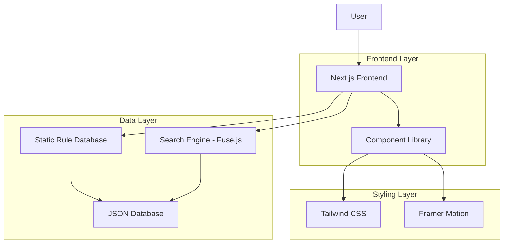
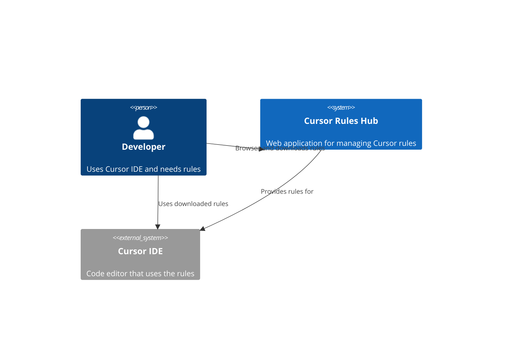
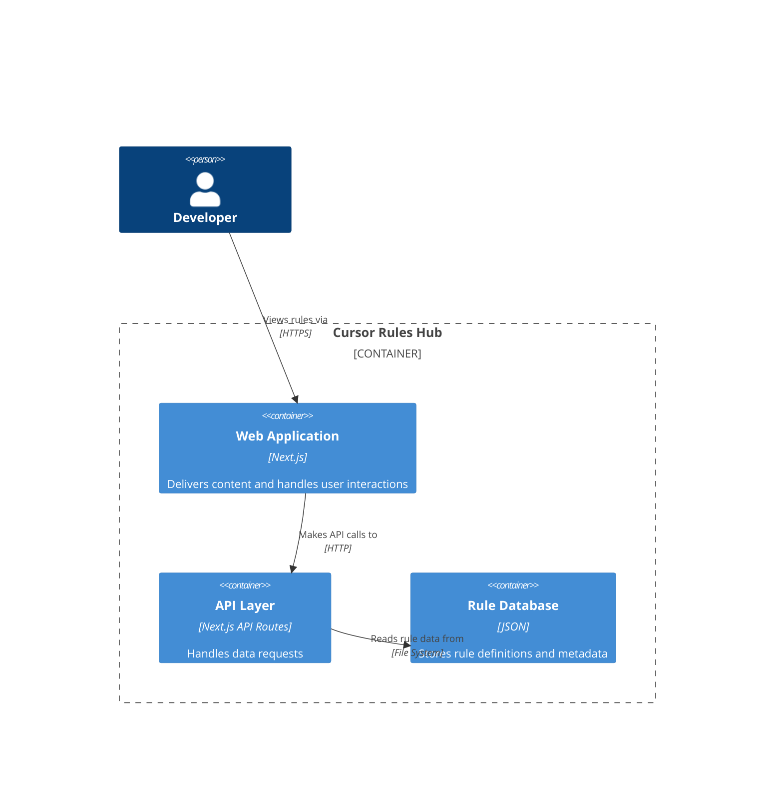
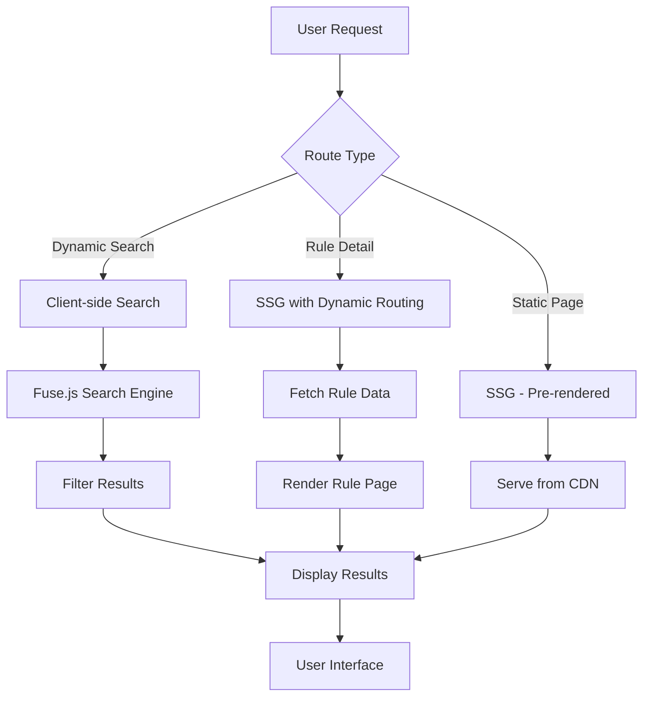
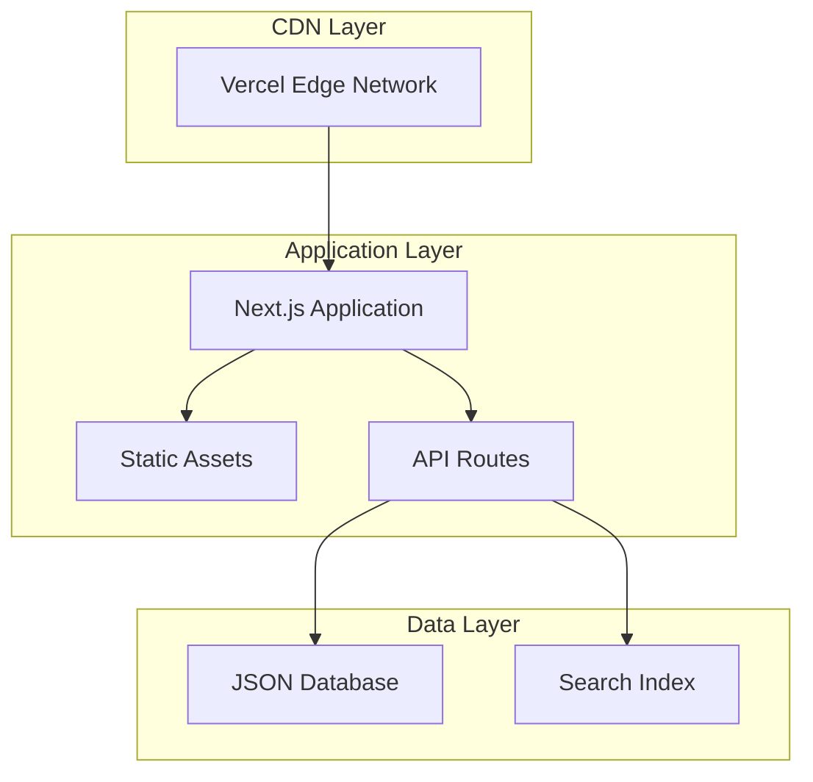
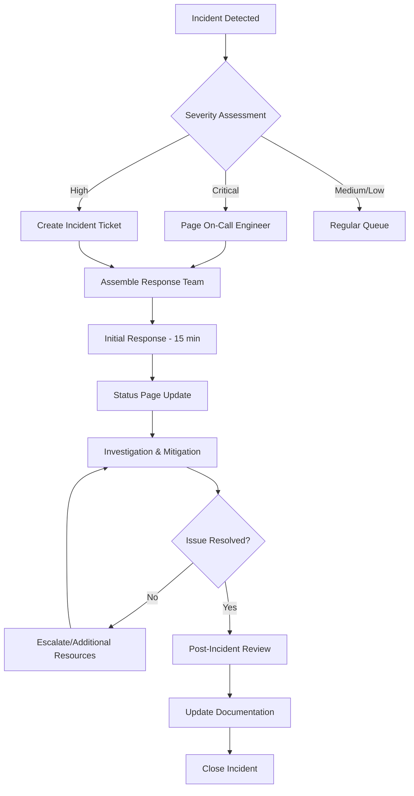

# 🎯 Cursor Rules Hub

A modern, AI-themed web application for discovering, sharing, and managing Cursor IDE rules. Built with Next.js 14, TypeScript, and Tailwind CSS.

[](https://opensource.org/licenses/MIT)
[](https://nextjs.org/)
[](https://www.typescriptlang.org/)
[](https://tailwindcss.com/)

## 🚀 Features

- **326+ Comprehensive Rules**: Curated collection across 21 categories
- **46 Technology Tags**: Advanced filtering and discovery
- **Full-Text Search**: Powered by Fuse.js with intelligent ranking
- **Modern UI/UX**: Dark mode with neon accents and smooth animations
- **Responsive Design**: Mobile-first approach with perfect scaling
- **Performance Optimized**: Code splitting, lazy loading, and SEO optimization
- **Accessibility First**: WCAG compliant with screen reader support

## 📋 Table of Contents

- [Quick Start](#-quick-start)
- [Installation](#-installation)
- [Usage](#-usage)
- [Architecture](#-architecture)
- [API Documentation](#-api-documentation)
- [Development](#-development)
- [Deployment](#-deployment)
- [Contributing](#-contributing)
- [Documentation](#-documentation)
- [Support](#-support)

## ⚡ Quick Start

```bash
# Clone the repository
git clone https://github.com/sk3pp3r/cursor-rules-hub.git
cd cursor-rules-hub

# Install dependencies
npm install

# Start development server
npm run dev

# Open your browser
open http://localhost:3000
```

## 🛠️ Installation

### Prerequisites

- **Node.js**: >= 18.0.0
- **npm**: >= 9.0.0 (or yarn/pnpm)
- **Git**: Latest version

### Environment Setup

1. **Clone the repository**
```bash
git clone https://github.com/sk3pp3r/cursor-rules-hub.git
cd cursor-rules-hub
```

2. **Install dependencies**
```bash
npm install
# or
yarn install
# or
pnpm install
```

3. **Environment variables** (optional)
```bash
cp .env.example .env.local
```

4. **Start development server**
```bash
npm run dev
```

### Docker Setup (Alternative)

```bash
# Build Docker image
docker build -t cursor-rules-hub .

# Run container
docker run -p 3000:3000 cursor-rules-hub
```

## 📖 Usage

### Basic Navigation

- **Home Page**: Browse featured rules and categories
- **Search**: Use the global search bar with filters
- **Categories**: Explore rules by technology or use case
- **Rule Details**: View complete rule content and metadata

### Search Features

- **Text Search**: Find rules by name, description, or content
- **Category Filters**: Filter by Frontend, Backend, DevOps, etc.
- **Technology Tags**: Filter by React, Vue, Python, etc.
- **Combined Filters**: Mix and match for precise results

### Rule Management

```typescript
// Example: Accessing rule data
import { getRules, searchRules } from '@/lib/database'

// Get all rules
const allRules = getRules()

// Search with filters
const reactRules = searchRules({
  query: 'React',
  categories: ['Frontend'],
  tags: ['react', 'typescript']
})
```

## 🏗️ Architecture

### System Overview



### C4 Model Architecture

#### Level 1: System Context


#### Level 2: Container Diagram


### Data Flow Diagram



### Network Topology



## 📚 API Documentation

### Core API Endpoints

#### GET /api/rules
Returns all rules with optional filtering.

**Parameters:**
- `category` (optional): Filter by category
- `tags` (optional): Comma-separated list of tags
- `search` (optional): Search query string

**Response:**
```json
{
  "rules": [
    {
      "id": "abc123",
      "name": "React TypeScript Setup",
      "slug": "react-typescript-setup",
      "description": "Complete setup for React with TypeScript",
      "content": "// Rule content here",
      "author": "developer",
      "categories": ["Frontend"],
      "tags": ["react", "typescript"],
      "created_at": "2024-01-01T00:00:00Z",
      "rating": 4.8,
      "downloads": 1250
    }
  ],
  "total": 326,
  "page": 1,
  "per_page": 20
}
```

#### GET /api/rules/[slug]
Returns a specific rule by slug.

**Response:**
```json
{
  "rule": {
    "id": "abc123",
    "name": "React TypeScript Setup",
    "slug": "react-typescript-setup",
    "description": "Complete setup for React with TypeScript",
    "content": "// Full rule content with detailed configuration",
    "author": "developer",
    "source_repo": "PatrickJS/awesome-cursorrules",
    "categories": ["Frontend"],
    "tags": ["react", "typescript", "vite"],
    "language_support": ["typescript", "javascript"],
    "file_size": 2048,
    "created_at": "2024-01-01T00:00:00Z",
    "updated_at": "2024-01-15T00:00:00Z",
    "rating": 4.8,
    "downloads": 1250,
    "favorites": 89
  }
}
```

#### GET /api/categories
Returns all available categories with rule counts.

**Response:**
```json
{
  "categories": [
    {
      "name": "Frontend",
      "count": 85,
      "description": "Rules for frontend frameworks and libraries"
    },
    {
      "name": "Backend",
      "count": 67,
      "description": "Server-side development rules"
    }
  ]
}
```

#### GET /api/tags
Returns all available tags with usage statistics.

**Response:**
```json
{
  "tags": [
    {
      "name": "react",
      "count": 45,
      "category": "Frontend"
    },
    {
      "name": "typescript",
      "count": 78,
      "category": "Language"
    }
  ]
}
```

### OpenAPI/Swagger Documentation

Complete API documentation is available at `/api/docs` when running in development mode.

**Swagger UI Features:**
- Interactive API explorer
- Request/response examples
- Authentication details
- Rate limiting information

## 🧑‍💻 Development

### Project Structure

```
cursor-rules-hub/
├── src/
│   ├── app/                 # Next.js App Router pages
│   │   ├── categories/      # Category pages
│   │   ├── rules/          # Rule detail pages
│   │   ├── search/         # Search functionality
│   │   └── layout.tsx      # Root layout
│   ├── components/         # Reusable React components
│   │   ├── Header.tsx      # Navigation header
│   │   └── RuleCard.tsx    # Rule display component
│   ├── lib/                # Utility functions
│   │   ├── database.ts     # Database operations
│   │   └── utils.ts        # Helper functions
│   ├── types/              # TypeScript type definitions
│   │   └── rule.ts         # Rule interface
│   └── data/               # Static data files
│       └── cursor_rules_database.json
├── public/                 # Static assets
├── docs/                   # Documentation
├── .cursorrules           # Project-specific Cursor rules
└── package.json
```

### Development Workflow

1. **Feature Development**
```bash
# Create feature branch
git checkout -b feature/new-feature

# Make changes and test
npm run dev
npm run test
npm run lint

# Commit and push
git commit -m "feat: add new feature"
git push origin feature/new-feature
```

2. **Code Quality**
```bash
# Type checking
npm run type-check

# Linting
npm run lint
npm run lint:fix

# Formatting
npm run format

# Testing
npm run test
npm run test:watch
```

3. **Build and Preview**
```bash
# Production build
npm run build

# Start production server
npm start

# Export static site
npm run export
```

### Testing Strategy

- **Unit Tests**: Component and utility function tests
- **Integration Tests**: API endpoint testing
- **E2E Tests**: User journey testing with Playwright
- **Visual Regression**: Component screenshot testing

## 🚀 Deployment

### Vercel Deployment (Recommended)

1. **Automatic Deployment**
```bash
# Connect to Vercel
vercel

# Deploy to production
vercel --prod
```

2. **Environment Variables**
```bash
# Set environment variables
vercel env add NEXT_PUBLIC_SITE_URL
```

### Docker Deployment

```dockerfile
# Dockerfile
FROM node:18-alpine AS deps
RUN apk add --no-cache libc6-compat
WORKDIR /app
COPY package*.json ./
RUN npm ci --only=production

FROM node:18-alpine AS builder
WORKDIR /app
COPY --from=deps /app/node_modules ./node_modules
COPY . .
RUN npm run build

FROM node:18-alpine AS runner
WORKDIR /app
ENV NODE_ENV production
COPY --from=builder /app/public ./public
COPY --from=builder /app/.next/standalone ./
COPY --from=builder /app/.next/static ./.next/static
EXPOSE 3000
CMD ["node", "server.js"]
```

### Static Export

```bash
# Generate static export
npm run build
npm run export

# Deploy to any static hosting
rsync -avz out/ user@server:/var/www/html/
```

## 🤝 Contributing

We welcome contributions! Please see our [Contributing Guide](CONTRIBUTING.md) for details.

### Quick Contribution Steps

1. Fork the repository
2. Create a feature branch
3. Make your changes
4. Add tests for new functionality
5. Ensure all tests pass
6. Submit a pull request

### Development Setup for Contributors

```bash
# Fork and clone
git clone https://github.com/your-username/cursor-rules-hub.git
cd cursor-rules-hub

# Install dependencies
npm install

# Create feature branch
git checkout -b feature/your-feature

# Make changes and test
npm run dev
npm run test

# Submit PR
git push origin feature/your-feature
```

## 📋 Documentation

### Available Documentation

- **[Architecture Decision Records (ADRs)](docs/adr/)**: Technical decisions and rationale
- **[API Documentation](docs/api/)**: Detailed API reference with examples
- **[Runbooks](docs/runbooks/)**: Operational procedures and troubleshooting
- **[Disaster Recovery](docs/disaster-recovery/)**: Business continuity procedures
- **[Incident Response](docs/incident-response/)**: Emergency response procedures

### Architecture Decision Records (ADRs)

| ADR | Title | Status | Date |
|-----|-------|--------|------|
| [ADR-001](docs/adr/001-frontend-framework.md) | Choice of Next.js 14 for Frontend | Accepted | 2024-01-01 |
| [ADR-002](docs/adr/002-styling-approach.md) | Tailwind CSS for Styling | Accepted | 2024-01-01 |
| [ADR-003](docs/adr/003-data-storage.md) | JSON Database for Static Data | Accepted | 2024-01-01 |
| [ADR-004](docs/adr/004-search-implementation.md) | Fuse.js for Client-side Search | Accepted | 2024-01-01 |

### Runbooks

- **[Deployment Runbook](docs/runbooks/deployment.md)**: Step-by-step deployment procedures
- **[Monitoring Runbook](docs/runbooks/monitoring.md)**: Health checks and alerting
- **[Backup Runbook](docs/runbooks/backup.md)**: Data backup and restoration
- **[Security Runbook](docs/runbooks/security.md)**: Security incident procedures

### Disaster Recovery Procedures

#### Recovery Time Objectives (RTO)
- **Critical**: 1 hour
- **High**: 4 hours
- **Medium**: 24 hours
- **Low**: 72 hours

#### Recovery Point Objectives (RPO)
- **Database**: 15 minutes
- **Static Assets**: 1 hour
- **Configuration**: 1 hour

#### Testing Schedule
- **Monthly**: Backup restoration testing
- **Quarterly**: Full disaster recovery simulation
- **Annually**: Business continuity plan review

### Incident Response Flowchart



### Diagrams and Visual Documentation

All diagrams are maintained using:
- **Mermaid**: For flowcharts and system diagrams (embedded in markdown)
- **Draw.io**: For complex architecture diagrams ([draw.io files](docs/diagrams/))
- **Lucidchart**: For network topology ([shared workspace](https://lucid.app/workspace))

## 🆘 Support

### Getting Help

- **Documentation**: Check our comprehensive docs above
- **Issues**: [GitHub Issues](https://github.com/sk3pp3r/cursor-rules-hub/issues)
- **Discussions**: [GitHub Discussions](https://github.com/sk3pp3r/cursor-rules-hub/discussions)
- **Email**: support@cursor-rules-hub.com

### Troubleshooting

#### Common Issues

1. **Build Failures**
```bash
# Clear cache and reinstall
rm -rf .next node_modules package-lock.json
npm install
npm run build
```

2. **Search Not Working**
```bash
# Verify database integrity
npm run validate-database
```

3. **Performance Issues**
```bash
# Analyze bundle size
npm run analyze
```

#### Debug Mode

```bash
# Enable debug logging
DEBUG=* npm run dev

# Production debugging
NODE_ENV=production DEBUG=app:* npm start
```

## 📄 License

This project is licensed under the MIT License - see the [LICENSE](LICENSE) file for details.

## 🙏 Acknowledgments

- **[PatrickJS](https://github.com/PatrickJS/awesome-cursorrules)**: Original awesome-cursorrules collection
- **[sk3pp3r](https://github.com/sk3pp3r)**: Additional rule contributions
- **Cursor Team**: For creating an amazing IDE
- **Next.js Team**: For the excellent framework
- **Vercel**: For hosting and deployment platform

---

<div align="center">
  <p>Built with ❤️ for the Cursor IDE community</p>
  <p>
    <a href="https://cursor-rules-hub.vercel.app">🌐 Live Demo</a> •
    <a href="https://github.com/sk3pp3r/cursor-rules-hub/issues">🐛 Report Bug</a> •
    <a href="https://github.com/sk3pp3r/cursor-rules-hub/issues">✨ Request Feature</a>
  </p>
</div> 