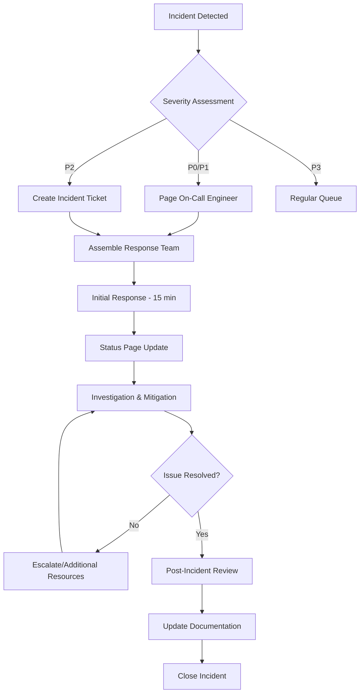

# Incident Response Plan

## Overview
This document outlines the incident response procedures for the Cursor Rules Hub application to ensure rapid detection, response, and resolution of service disruptions.

## Incident Classification

### Severity Levels

#### P0 - Critical (Response: Immediate)
- **Definition**: Complete service outage affecting all users
- **Examples**: 
  - Website completely inaccessible
  - Database corruption preventing all functionality
  - Security breach with data exposure
- **Response Time**: 15 minutes
- **Resolution Target**: 1 hour

#### P1 - High (Response: 30 minutes)
- **Definition**: Major functionality impacted affecting majority of users
- **Examples**:
  - Search functionality completely broken
  - Major pages returning 500 errors
  - Performance degradation >5 seconds page load
- **Response Time**: 30 minutes
- **Resolution Target**: 4 hours

#### P2 - Medium (Response: 2 hours)
- **Definition**: Limited functionality impacted affecting some users
- **Examples**:
  - Specific categories not loading
  - Some rules returning 404 errors
  - Minor performance issues
- **Response Time**: 2 hours
- **Resolution Target**: 24 hours

#### P3 - Low (Response: Next business day)
- **Definition**: Minor issues with workarounds available
- **Examples**:
  - Cosmetic UI issues
  - Non-critical feature bugs
  - Documentation errors
- **Response Time**: Next business day
- **Resolution Target**: 72 hours

## Incident Response Team

### Primary Roles
- **Incident Commander**: Overall response coordination
- **Technical Lead**: Technical investigation and resolution
- **Communications Lead**: Stakeholder and user communication
- **Product Owner**: Business impact assessment

### Contact Information
```
Primary On-Call Engineer: [phone] [email]
Backup On-Call Engineer: [phone] [email]
DevOps Team: [email]
Product Manager: [email]
Executive Sponsor: [email]
```

### On-Call Schedule
- **Primary**: Week-long rotations
- **Secondary**: 24/7 backup coverage
- **Escalation**: After 30 minutes if no response

## Detection and Alerting

### Monitoring Systems
1. **Uptime Monitoring**: Pingdom/UptimeRobot
2. **Performance Monitoring**: Vercel Analytics
3. **Error Tracking**: Sentry (if configured)
4. **User Reports**: GitHub Issues, email

### Alert Channels
- **P0/P1**: Phone call + SMS + Slack
- **P2**: Slack + Email
- **P3**: Email only

### Key Metrics to Monitor
- **Availability**: 99.9% uptime target
- **Performance**: <2 seconds page load time
- **Error Rate**: <0.1% error rate
- **User Experience**: Search success rate >95%

## Incident Response Process



### Phase 1: Detection and Initial Response (0-15 minutes)

1. **Incident Detection**
   - Automated monitoring alerts
   - User reports via GitHub/email
   - Internal team discovery

2. **Initial Assessment**
   - Verify the incident is real
   - Determine severity level
   - Check for obvious causes

3. **Team Assembly**
   - Page appropriate team members based on severity
   - Establish communication channels
   - Assign incident commander

### Phase 2: Investigation and Mitigation (15 minutes - 4 hours)

1. **Status Communication**
   - Update status page within 15 minutes
   - Notify stakeholders via Slack
   - Create incident ticket with timeline

2. **Technical Investigation**
   ```bash
   # Quick health checks
   curl -I https://cursor-rules-hub.vercel.app
   
   # Check Vercel deployment status
   vercel ls
   
   # Check recent commits
   git log --oneline -10
   
   # Verify database integrity
   jq '.meta.total_rules' src/data/cursor_rules_database.json
   ```

3. **Mitigation Actions**
   - Apply immediate fixes if available
   - Implement workarounds
   - Rollback recent deployments if necessary

### Phase 3: Resolution and Recovery

1. **Implement Permanent Fix**
   - Deploy proper solution
   - Verify resolution across all affected areas
   - Monitor for regression

2. **Service Restoration Verification**
   - Run full health checks
   - Verify all functionality restored
   - Confirm performance metrics normal

3. **Communication Update**
   - Update status page with resolution
   - Notify stakeholders of resolution
   - Thank users for patience

### Phase 4: Post-Incident Activities

1. **Post-Incident Review** (within 48 hours)
   - Timeline reconstruction
   - Root cause analysis
   - Impact assessment
   - Response effectiveness evaluation

2. **Action Items**
   - Prevention measures
   - Process improvements
   - Monitoring enhancements
   - Documentation updates

## Communication Procedures

### Internal Communication

#### Slack Channels
- `#incidents`: Primary incident coordination
- `#dev-alerts`: Automated monitoring alerts
- `#general`: Broader team updates

#### Communication Templates

**Initial Incident Notification:**
```
🚨 INCIDENT P[X] - [Title]
📅 Started: [timestamp]
🎯 Status: Investigating
📊 Impact: [description]
👤 IC: [incident commander]
🔗 Incident: [ticket link]
```

**Status Updates:**
```
📢 UPDATE - [Title]
🕐 [timestamp]
📊 Current Status: [status]
🔧 Actions Taken: [actions]
⏭️ Next Steps: [next steps]
⏱️ ETA: [estimated resolution]
```

**Resolution Notification:**
```
✅ RESOLVED - [Title]
🕐 Resolved: [timestamp]
⏱️ Duration: [total time]
🔧 Resolution: [what was done]
📝 PIR: [link to post-incident review]
```

### External Communication

#### Status Page Updates
- Initial incident acknowledgment within 15 minutes
- Regular updates every 30 minutes for P0/P1
- Resolution confirmation

#### User Communication
- GitHub pinned issue for major incidents
- Twitter updates for widespread issues
- Email notifications for subscribers (if available)

### Communication Escalation
- **30 minutes**: Notify product management
- **1 hour**: Notify executive leadership
- **2 hours**: Consider public communication
- **4 hours**: Executive communication required

## Recovery Procedures

### Immediate Recovery Actions

1. **Service Restoration Priority**
   - Core functionality first
   - Search capabilities second
   - Non-essential features last

2. **Data Integrity Verification**
   ```bash
   # Verify database structure
   jq '.meta' src/data/cursor_rules_database.json
   
   # Check rule count consistency
   jq '.rules | length' src/data/cursor_rules_database.json
   
   # Validate JSON structure
   jq empty src/data/cursor_rules_database.json
   ```

3. **Performance Validation**
   ```bash
   # Check response times
   curl -w "@curl-format.txt" -o /dev/null -s https://cursor-rules-hub.vercel.app
   
   # Verify search functionality
   curl -s "https://cursor-rules-hub.vercel.app/api/rules?search=react" | jq '.rules | length'
   ```

### Rollback Procedures

#### Vercel Rollback
```bash
# List recent deployments
vercel ls

# Rollback to previous deployment
vercel promote [previous-deployment-url]
```

#### Database Rollback
```bash
# Restore from backup (if available)
git checkout HEAD~1 -- src/data/cursor_rules_database.json
git commit -m "Emergency rollback of database"
git push origin main
```

### Business Continuity

1. **Critical Functions**
   - Homepage accessibility
   - Rule browsing capability
   - Search functionality
   - Rule detail pages

2. **Acceptable Degradation**
   - Reduced search performance
   - Limited filtering options
   - Simplified UI during recovery

## Post-Incident Review Process

### PIR Meeting (within 48 hours)
- **Duration**: 60 minutes maximum
- **Attendees**: All incident responders + stakeholders
- **Focus**: Learning, not blame

### PIR Document Template
```markdown
# Post-Incident Review - [Date] - [Title]

## Incident Summary
- **Start Time**: [timestamp]
- **End Time**: [timestamp]
- **Duration**: [duration]
- **Severity**: P[X]
- **Impact**: [description]

## Timeline
| Time | Event | Action |
|------|-------|--------|
| [timestamp] | [event] | [action taken] |

## Root Cause Analysis
### Primary Cause
[Description of the root cause]

### Contributing Factors
- [Factor 1]
- [Factor 2]

## What Went Well
- [Positive aspect 1]
- [Positive aspect 2]

## What Could Be Improved
- [Improvement area 1]
- [Improvement area 2]

## Action Items
| Action | Owner | Due Date | Priority |
|--------|-------|----------|----------|
| [Action 1] | [Owner] | [Date] | [Priority] |

## Lessons Learned
- [Lesson 1]
- [Lesson 2]
```

### Follow-up Actions
1. **Prevention Measures**
   - Code changes
   - Process improvements
   - Monitoring enhancements

2. **Response Improvements**
   - Training needs
   - Tool enhancements
   - Documentation updates

3. **Communication Improvements**
   - Template updates
   - Channel optimizations
   - Stakeholder feedback

## Training and Preparedness

### Regular Drills
- **Monthly**: Communication drill
- **Quarterly**: Full incident simulation
- **Annually**: Disaster recovery test

### Training Requirements
- New team members: Incident response training within 30 days
- Annual refresher training for all team members
- Role-specific training for incident commanders

### Documentation Maintenance
- **Monthly**: Review and update contact information
- **Quarterly**: Review and update procedures
- **Annually**: Complete document review

## Tools and Resources

### Incident Management Tools
- **GitHub Issues**: Incident tracking
- **Slack**: Real-time communication
- **Vercel Dashboard**: Deployment management
- **Status Page**: External communication

### Monitoring and Diagnostics
- **Vercel Analytics**: Performance monitoring
- **Browser DevTools**: Client-side debugging
- **cURL**: API testing
- **jq**: JSON processing

### Emergency Resources
- **Runbooks**: [link to runbooks]
- **Architecture Docs**: [link to architecture]
- **Contact Lists**: [link to contacts]
- **Escalation Matrix**: [link to escalation]

---

**Document Version**: 1.0  
**Last Updated**: 2024-01-01  
**Owner**: DevOps Team  
**Next Review**: 2024-04-01 